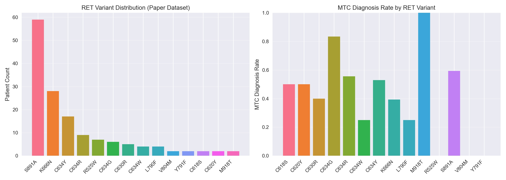
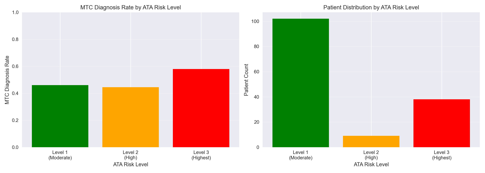
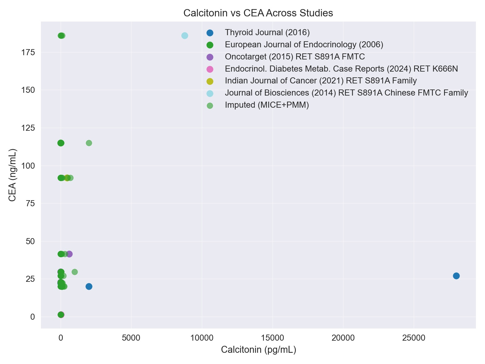
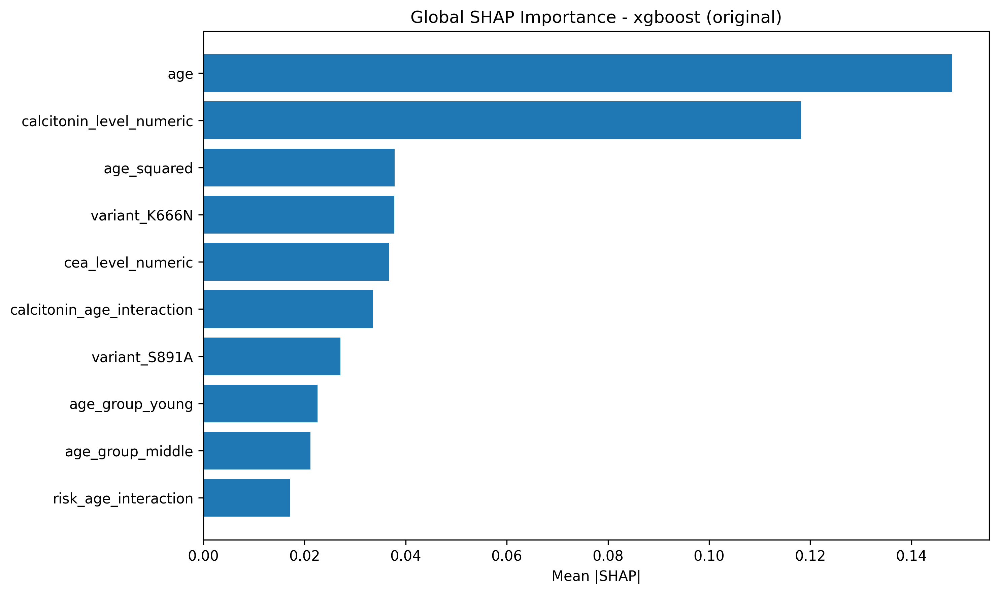

Can we save those 20k Rs people with just a simple blood test?

# MEN2 Predictor: can routine blood data help study rare cancer risk?

## Abstract

Genetic testing for multiple endocrine neoplasia type 2 (MEN2) costs about INR 20,000 in India, or roughly $225 USD. That price puts a life-saving diagnosis out of reach for most families. MEN2 Predictor asks whether routine blood biomarkers and clinical features contain enough signal to predict medullary thyroid carcinoma (MTC) status among confirmed RET carriers. The project combines an open dataset built from published cases with a reproducible machine-learning benchmark. Its results are promising enough to study further. They are far too early for clinical use.

## Why this question matters

MEN2 is an inherited cancer syndrome linked to pathogenic variants in the RET gene. Its main threat is MTC, a cancer that begins in the thyroid's calcitonin-producing C cells. A confirmed RET result can guide monitoring for a patient and their relatives. It may also affect the timing of preventive surgery.

The cost creates a hard access problem. Could a model use calcitonin, carcinoembryonic antigen (CEA), age, family history, and routine clinical findings to estimate MTC risk before expensive sequencing is available?

There is an important boundary here. A blood model cannot identify a RET variant. RET sequencing remains the test for carrier status. The research question is narrower: do low-cost clinical features contain a pattern worth testing in a larger study?

## Building a dataset from scattered evidence

[MEN2 Predictor](https://github.com/ArjunCodess/men2-predictor) collects 149 confirmed RET carriers from 10 peer-reviewed studies. The dataset contains 73 MTC-positive records and 76 MTC-negative records across 14 RET variants. Each row keeps its source information, so researchers can trace it back to the paper it came from. The anonymized dataset is available on [Zenodo](https://doi.org/10.5281/zenodo.20594453).

That sounds tidy. The figure below shows why it is not. S891A makes up 59 records, while several variants appear only twice. An MTC rate based on two people is fragile. A model may learn the dominant families and papers instead of a pattern that travels to a new hospital.

*The left panel shows how many carrier records were available for each RET variant. The right panel shows the observed MTC rate. Empty or extreme bars often come from very small groups. Source: `paper/figures_jpeg/Figure_1_variant_distribution.jpg` in the local MEN2 Predictor repository.*

The same imbalance appears when variants are grouped by American Thyroid Association risk level. Most records fall in the moderate-risk group. The highest-risk group has fewer than half as many. This matters because overall accuracy can hide weak performance in a small subgroup.

*MTC rates differ across ATA risk groups, while the number of records is heavily weighted toward the moderate-risk group. Source: `charts/risk_level_analysis.png` in the local repository.*

## The biomarker evidence is thin

Calcitonin has a direct link to MTC biology because thyroid C cells produce it. CEA is less specific, though it can rise as disease advances. In theory, the pair could help a model separate useful patterns from noise.

The real data are sparse. Only 12 records have paired observed calcitonin and CEA values. The other 137 CEA values are filled using multiple imputation by chained equations with predictive mean matching, called MICE+PMM. The observed correlation is weak at about 0.116.

*The coloured study points are the scarce observed pairs. Green points mark imputed values. The wide spread and extreme calcitonin outliers make the limitation visible. Source: `paper/figures_jpeg/Figure_3_calcitonin_cea_relationship.jpg` in the local repository.*

Imputation lets the pipeline run. It does not turn missing lab tests into new observations. That is why the project includes a no-CEA analysis. If a model changes sharply when CEA is removed, confidence in that model should drop.

## Four ways to test the idea

The benchmark uses linked analysis settings rather than one flattering score:

- Genotype-blind models leave out RET variant information.
- Genotype-aware models include sequencing information.
- No-CEA models test dependence on a heavily imputed biomarker.
- Synthetic-augmentation models study what changes when simulated records expand the dataset.

The first contribution is the open literature-derived dataset. The second is this reproducible benchmark design. Together, they make it possible to ask where a model's apparent skill comes from.

## What the saved results show

On the real literature-derived cohort, XGBoost reached 93.3% sensitivity and 83.3% accuracy on the standard held-out split. Its precision was 77.8%, its F1 score was 84.9%, and its ROC AUC was 0.911. This model anchors the genotype-blind and genotype-aware analyses.

The synthetic experiment produced two different leaders. Logistic regression found 49 of 51 positive cases, giving it 96.1% sensitivity. Its accuracy was only 73.8%, and its precision was 48.0%. LightGBM reached the highest synthetic accuracy at 93.3%, with 86.3% sensitivity and a ROC AUC of 0.981.

| Dataset and model | Accuracy | Sensitivity | Precision | F1 | ROC AUC |
|---|---:|---:|---:|---:|---:|
| Real cohort, XGBoost | 83.3% | 93.3% | 77.8% | 84.9% | 0.911 |
| Synthetic, logistic regression | 73.8% | 96.1% | 48.0% | 64.1% | 0.941 |
| Synthetic, LightGBM | 93.3% | 86.3% | 86.3% | 86.3% | 0.981 |

The synthetic rows are simulation data. Their scores are not estimates of clinical performance. Logistic regression's high sensitivity also comes with many false positives, which its low precision makes clear.

## What XGBoost learned

SHAP analysis gives a rough view of which features moved the real-cohort XGBoost predictions. Age ranks first. Calcitonin ranks second. CEA appears much lower. The chart fits the project's core idea because a routine blood marker contributes useful signal. It also raises a warning. Age can act as a shortcut for disease progression or for differences between the source studies.

*Mean absolute SHAP values rank how strongly each feature changed the model's predictions. They do not prove that a feature causes MTC. Source: `charts/shap/xgboost/original_bar.png` in the local repository.*

## A tougher validation changes the picture

A random held-out split can place members of the same study or family on both sides of the test boundary. The repository also includes leave-one-study-out validation, where each paper is held out in turn. Under that harder test, genotype-blind XGBoost reached 87.7% sensitivity and 72.5% accuracy. The genotype-aware version reached 82.2% sensitivity and 65.1% accuracy.

Those lower numbers are useful. They show how much performance depends on the evaluation setup. Ten studies are still too few for a stable clinical estimate, and several folds contain only two or three patients.

## Keep the claim modest

> **Safety statement:** MEN2 Predictor is a research benchmark. It is not a diagnostic, screening, triage, or clinical decision-support system. Its outputs must not guide testing, surgery, treatment, or follow-up.

Prospective validation would need patients collected across several Indian hospitals. Labs would need consistent assay methods and fixed thresholds. Researchers would also need to report performance for each risk group and count every false negative.

So, can a simple blood test save families INR 20,000? We do not know. The current work shows that routine clinical data carry a measurable signal in a small published cohort. It also shows exactly where the evidence is weak. That honest combination is what makes MEN2 Predictor useful as a benchmark.

## Project links

- Repository: [github.com/ArjunCodess/men2-predictor](https://github.com/ArjunCodess/men2-predictor)
- Open anonymized dataset: [doi.org/10.5281/zenodo.20594453](https://doi.org/10.5281/zenodo.20594453)
